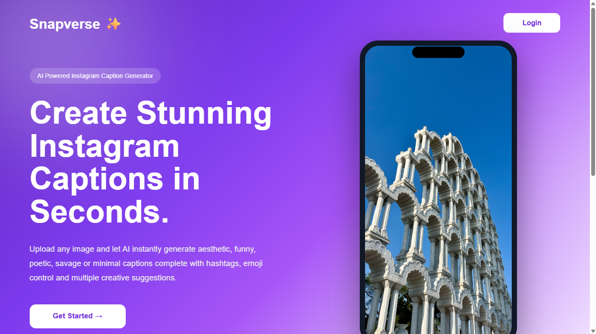
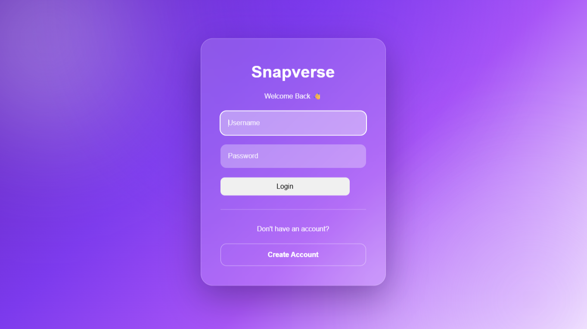
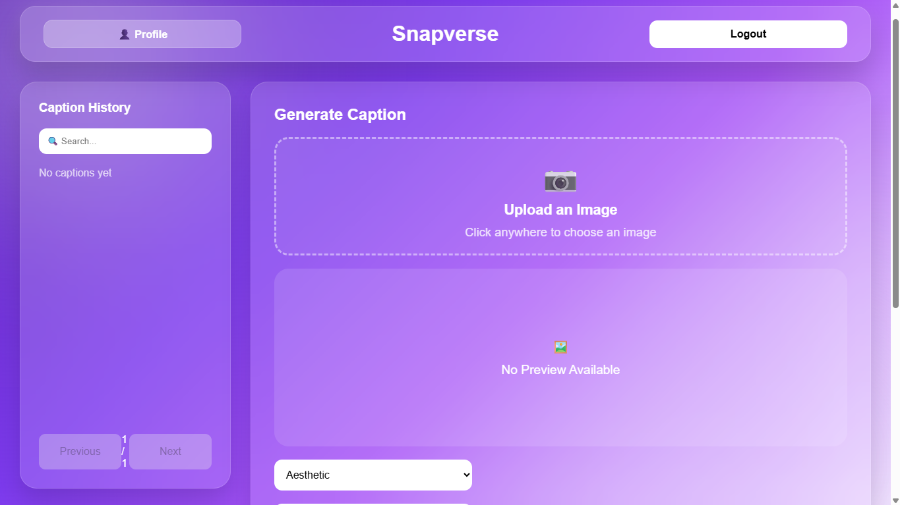
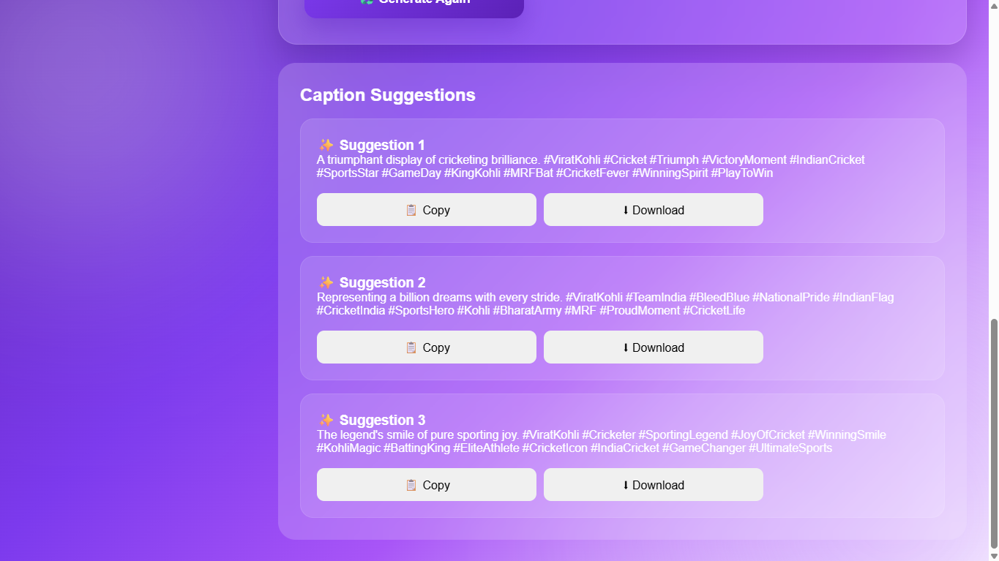

# 📸 Snapverse AI

> An AI-powered Instagram Caption Generator that transforms your images into engaging, social-media-ready captions using Google's Gemini AI.

🌐 **Live Demo:** https://snapverse-gzuud14te-mukti18.vercel.app

⚡ **Backend API:** https://snapverse-api26.onrender.com/docs

---

## ✨ Overview

Snapverse is a full-stack AI web application that analyzes uploaded images and generates multiple Instagram-ready captions in different styles. Users can customize caption tone, emoji intensity, and length while securely storing their caption history.

Designed with a modern glassmorphism UI and deployed to the cloud, Snapverse demonstrates real-world AI integration, authentication, database management, and production deployment.

---

## 🚀 Features

### 🤖 AI Caption Generation

- Analyze uploaded images using Google Gemini AI
- Generate **3 unique captions** instantly
- Smart image understanding before caption creation

### 🎭 Multiple Caption Styles

- 🌸 Aesthetic
- 😂 Funny
- 😎 Savage
- ✨ Minimal
- 📖 Poetic

### ⚙️ Customization

- Emoji Intensity
  - None
  - Low
  - Medium
  - High

- Caption Length
  - Short
  - Medium
  - Long

### 👤 Authentication

- User Signup
- User Login
- JWT Authentication
- Secure Password Hashing

### 🗂 Caption History

- Save generated captions
- Search history
- Pagination
- Delete captions

### 📋 Utilities

- Copy captions
- Download captions
- Image preview before generation

---

# 🖥 Screenshots

### Landing Page



### Login



### Signup


### Dashboard



### Caption Generation



---

# 🏗 Tech Stack

## Frontend

- React
- Vite
- React Router
- Axios
- CSS3
- Glassmorphism UI

## Backend

- FastAPI
- Python
- SQLAlchemy
- JWT Authentication
- Passlib
- Pydantic

## AI

- Google Gemini 2.5 Flash

## Database

- PostgreSQL

## Cloud & Deployment

- Vercel
- Render
- Cloudinary
- Docker

---

# 📂 Project Structure

```
Snapverse
│
├── frontend
│   ├── src
│   ├── public
│   └── Dockerfile
│
├── backend
│   ├── main.py
│   ├── models.py
│   ├── crud.py
│   ├── auth.py
│   ├── security.py
│   ├── database.py
│   └── Dockerfile
│
├── docker-compose.yml
│
└── README.md
```

---

# ⚙️ Installation

## Clone Repository

```bash
git clone https://github.com/muktig2703-dot/snapverse

cd snapverse
```

---

## Backend

```bash
cd backend

python -m venv venv

venv\Scripts\activate

pip install -r requirements.txt

uvicorn main:app --reload
```

---

## Frontend

```bash
cd frontend

npm install

npm run dev
```

---

# 🐳 Docker

Run the complete application using Docker.

```bash
docker compose up
```

---

# 🔑 Environment Variables

Backend `.env`

```env
GEMINI_API_KEY=your_key

DATABASE_URL=your_database_url

SECRET_KEY=your_secret_key

CLOUDINARY_CLOUD_NAME=your_cloud_name

CLOUDINARY_API_KEY=your_api_key

CLOUDINARY_API_SECRET=your_api_secret
```

---

# 📡 API Endpoints

| Method | Endpoint            | Description         |
|--------|---------------------|---------------------|
| POST   | `/signup`           | Register User       |
| POST   | `/login`            | Login User          |
| POST   | `/generate-caption` | Generate AI Captions|
| GET    | `/history`          | Get Caption History |
| DELETE | `/history/{id}`     | Delete Caption      |

---

# 🌍 Deployment

Frontend

- Vercel

Backend

- Render

Database

- PostgreSQL (Render)

Image Hosting

- Cloudinary

---

# 🔮 Future Improvements

- Google Login
- Caption Translation
- AI Image Tags
- Video Caption Generation
- Caption Templates
- Trending Hashtags
- Multi-language Support
- Mobile Responsive Enhancements

---

# 👨‍💻 Author

**Mukti**

B.Tech Student | Full Stack Developer | AI Enthusiast

GitHub: https://github.com/muktig2703-dot

---

# ⭐ If you like this project

Give this repository a ⭐ on GitHub!